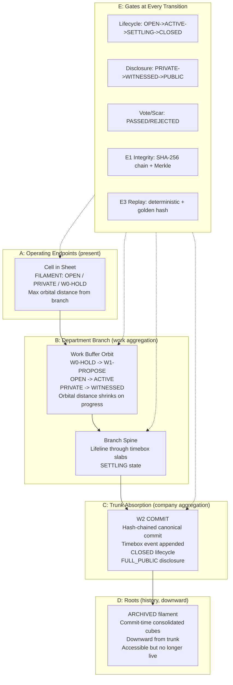
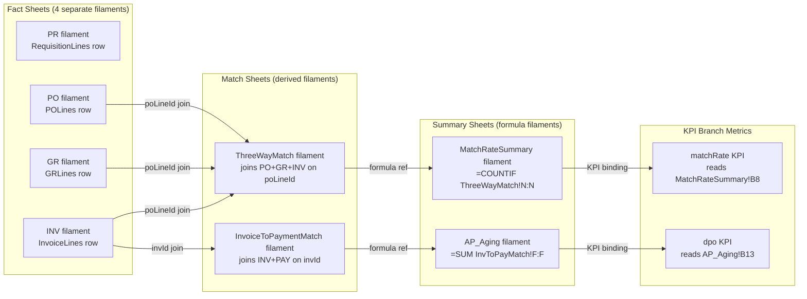
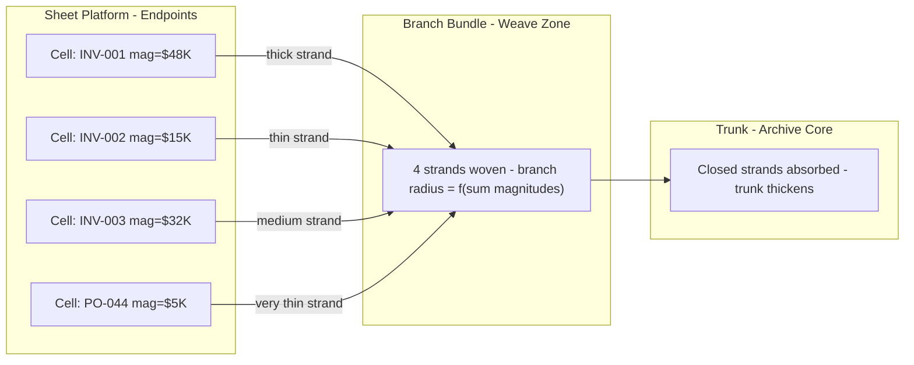
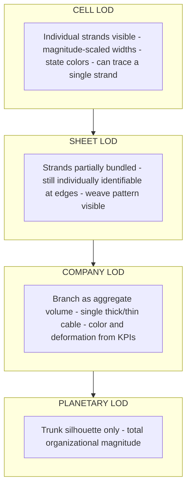
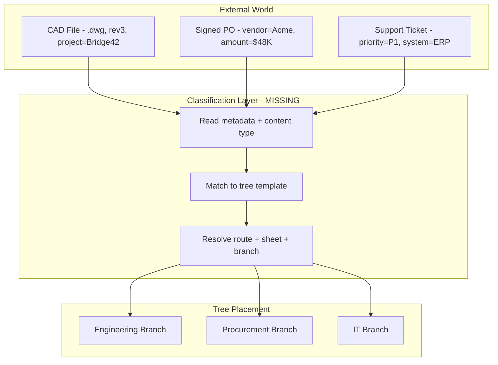

# Presence engine Git save
_Exported on 2/16/2026 at 21:27:04 GMT+2 from Cursor (2.4.37)_

---

**User**

@app/presence/presence-engine.js save to git?

---

**Cursor**

The diff only shows a line-ending warning (LF vs CRLF) with no actual content changes. Let me check more closely.

The only change in `app/presence/presence-engine.js` is a line-ending difference (LF to CRLF) — there are no content changes. Git shows it as modified, but the diff is empty.

Would you still like me to commit this line-ending change, or would you prefer to discard it with `git restore`? If there were recent edits you expected to see, they may have already been saved in a prior state.

---

**User**

discard

---

**Cursor**

Done — the line-ending change has been discarded. Working tree is clean.

---

**User**

a different machine has made numerous commits to our project. can you pull and summarize for me all modules that have been performed?

---

**Cursor**

There's only **1 new commit** from the remote. Let me see the details and then pull it in.

Now let me read the updated HANDOFF and the restoration index for a full picture.

Pull complete. Here's a summary of everything that came in with that commit:

---

## Incoming Commit: `feat(restoration): finalize visual slices and proof artifacts`

**48 files changed** (+3,734 lines / -506 lines). This single commit bundles the completion of **4 restoration slices** plus proof/process updates. Here's what was done:

---

### 1. VIS-GRAMMAR-POLISH-1 -- Visual Grammar Overlap Resolution (PASS)
- **What**: Megasheet overlap resolution + scaffold legibility pass
- Increased inter-ring spacing (1.8x) to prevent initial tile overlap
- Added radial push-apart collision resolver (30 iterations, early-exit on convergence)
- Achieves **overlaps=0** within 500m radius for 39 tiles
- Scaffold (7/7) and megasheet (6/6) proofs green
- **Files**: `relay-cesium-world.html`, new proof script `scripts/vis-grammar-polish-1-proof.mjs`

### 2. FILAMENT-LIFELINE-1 -- Ambient End-to-End Lifelines (PASS)
- **What**: New dedicated lifeline primitive in the renderer showing full filament flow: cell origin -> timebox slabs -> spine -> branch endpoint -> trunk absorption
- Lifecycle color mapping + attention-driven width (0.5-2.0)
- Visibility gated: only in `TREE_SCAFFOLD` + `SHEET/CELL` (never in collapsed canopy or megasheet)
- **Files**: `app/renderers/filament-renderer.js` (+346 lines), new proof script `scripts/filament-lifeline-1-proof.mjs`

### 3. VIS-LAUNCH-TREE-READABILITY-1 -- Launch First-Glance Readability (PASS)
- **What**: Polish the launch/company first impression so the tree reads as a proper silhouette
- Trunk dominance increased (core/shell/glow contrast)
- Branch silhouette simplified (lower rib/emissive emphasis)
- Company-collapsed tiles de-emphasized (lower alpha, smaller footprint, no interior grid)
- Non-focused rings suppressed in collapsed view
- Filament rain de-noised (density 2)
- Auto-dock refusal log converted to rate-limited status line
- **Files**: `app/renderers/filament-renderer.js`, `relay-cesium-world.html`, new proof script

### 4. E1-CRYPTO-1-TIGHTENING-1 -- Crypto Integrity Tightening Spec
- New spec document `docs/restoration/E1-CRYPTO-1-TIGHTENING-1-SPEC.md` (118 lines)

---

### Infrastructure & Process Updates
- **`.husky/pre-commit`** hook added (8 lines)
- **`package.json`** updated (+1 dependency)
- **`scripts/verify-integrity.mjs`** -- new integrity verification script
- **`HANDOFF.md`** updated with all 4 new slice results + next slice (DEMO-FLYBY-POLISH-1 queued)
- **`docs/process/ACTIVE-SLICE.md`** and **`SLICE-REGISTER.md`** updated
- **`docs/restoration/RESTORATION-INDEX.md`** created (49 lines) -- active capability manual
- **`archive/proofs/PROOF-INDEX.md`** created (55 lines) -- proof artifact index

### Proof Artifacts (screenshots + console logs)
- Filament lifeline proofs (3 screenshots + console log)
- Filament ride v1 proof re-run (screenshot + console log)
- V1 dev onboarding flyby re-run (6 screenshots + console log)
- Vis grammar polish proofs (3 screenshots + console log)
- Vis launch tree readability proofs (3 screenshots + console log)
- Updated megasheet and tree scaffold proof screenshots

---

**Next queued slice**: **DEMO-FLYBY-POLISH-1** -- polish demo flyby choreography (smooth camera glides, dwell times, no teleport jumps).

---

**User**

8353939 and bd2018c?

---

**Cursor**

Here's the breakdown:

### `bd2018c` — Your last commit (this machine)
- **Author**: Cruton1380 (you, via GitHub)
- **Date**: Mon Feb 16, 05:32 AM (+0200)
- **Subject**: `feat(e1-crypto-1): cryptographic integrity layer — hash chains, Merkle trees, tamper detection`
- This was the E1-CRYPTO-1 slice: SHA-256 hash chains, Merkle trees, inclusion proofs, tamper detection, replay pre-check. 9/9 proof PASS.

### `8353939` — The new commit (other machine)
- **Author**: Eitan Asulin (`eitana@bdo.co.il`)
- **Date**: Mon Feb 16, 6:01 PM (+0200) — about 12.5 hours later
- **Subject**: `feat(restoration): finalize visual slices and proof artifacts`
- This is the commit you just pulled. It bundles the 4 new restoration slices (VIS-GRAMMAR-POLISH-1, FILAMENT-LIFELINE-1, VIS-LAUNCH-TREE-READABILITY-1, E1-CRYPTO-1-TIGHTENING-1 spec) plus updated proofs and process docs.

Both commits are co-authored with Cursor. The repo is now at `8353939` (HEAD = origin/master), fully up to date.

---

**User**

Excellent check the Eitan Asulin commit made today and determine if what was added is acceptable as per our master plan

---

**Cursor**

Let me pull up the master plan, execution overlay, and the full commit diff in parallel.

Now let me read through the actual diff in detail.

I've now read the full master build plan, the R1 execution overlay, and every line of the commit diff. Here is my assessment:

---

## Verdict: ACCEPTABLE — with observations

The commit is **aligned with the master plan** and does not violate any frozen contracts. Here's the detailed breakdown:

---

### 1. Frozen Contracts (15) — NO VIOLATIONS

All 15 physics contracts from `RELAY-PHYSICS-CONTRACTS.md` are respected:

- **Fact sheets remain append-only** — no changes to data model
- **No hidden formulas** — no compute changes
- **Refusal is explicit** — all new code emits `[REFUSAL]` logs where expected (e.g., `LIFELINE_MISSING_ANCHOR`, `LIFELINE_MISSING_SLAB`, `CRYPTO_GATE_PRE_COMMIT_REFUSED`)
- **LOD responds to measured pain only** — lifelines are budget-gated (`sheetsDetailed > 0`, `expandedSheetsAllowed`)
- **Minimum required data, shortest retention, strictest scope** — no new persistence added
- **Tree motion only from timebox metrics** — no topology changes

### 2. Canonical Geometry Rules — PRESERVED

- **Opposite-side exit**, **parallel slab**, **bend-only-after-slab**, **Stage 2 single conduit** — none of these are touched
- The lifeline primitive follows the canonical staged path: `cell -> timebox slabs -> spine -> branch endpoint -> trunk` — this is **additive geometry** that traces the existing topology, not a new topology
- Sheet orientation (normal = -T) is unchanged

### 3. Rendering Contract — COMPLIANT

- All LAUNCH_THEME changes are **presentation-only** alpha/radius tuning in the launch profile; no world/proof mode changes
- VIS-LAUNCH-TREE-READABILITY-1 explicitly scopes itself to `LAUNCH_CANOPY` collapsed company view only
- FILAMENT-LIFELINE-1 correctly gates to `TREE_SCAFFOLD + SHEET/CELL` only, never in canopy or megasheet
- Scaffold and megasheet modes are untouched in their core logic

### 4. Slice Governance Process — FOLLOWED

- All 4 slices have:
  - Specs in `docs/restoration/`
  - Proof scripts with defined stages
  - PROOF-INDEX entries
  - SLICE-REGISTER rows
  - ACTIVE-SLICE updated
  - HANDOFF updated
  - RESTORATION-INDEX entries
- Each spec has explicit **Allowed Files** and **Forbidden** sections
- E1-CRYPTO-1-TIGHTENING-1 is correctly marked as **PROPOSE** (not COMMIT), meaning it's a spec draft awaiting execution — not prematurely claimed as done

### 5. R1 Execution Overlay Alignment — MOSTLY ALIGNED

The R1 plan's execution order is: R0-R5 -> Visual Grammar -> Temporal Navigation -> Presence. The commit operates in the visual grammar / readability zone, which is appropriate post-E1-CRYPTO-1. However:

**Observation:** VIS-GRAMMAR-POLISH-1, FILAMENT-LIFELINE-1, and VIS-LAUNCH-TREE-READABILITY-1 are **not explicitly named** in the R1 execution overlay. They are reasonable "polish/tightening" slices that logically follow the visual grammar stack (VIS-TREE-SCAFFOLD-1, HEIGHT-BAND-1, VIS-MEGASHEET-1) which is listed in R1. They don't disrupt the sequence — they're incremental improvements to already-completed work.

### 6. Code Quality — GOOD

- The lifeline renderer code (`renderFilamentLifelinesForSheet`, `_buildFilamentLifelineAnchors`, etc.) is well-structured with proper null checks, deterministic fallbacks, and explicit refusal logging
- The megasheet overlap resolver upgrade (AABB -> radial push-apart with 30 iterations + early exit) is a genuine improvement
- The CAM0.4.2 proof script stabilization (`relayGetRidePrereqs`, `relayStampFilamentCubes`) strengthens proof determinism
- The `verify-integrity.mjs` + pre-commit hook addition is appropriate hardening of E1-CRYPTO-1

---

### Flags (Non-Blocking)

1. **ACTIVE-SLICE shows VIS-LAUNCH-TREE-READABILITY-1 as the current slice**, but the commit bundles 4 slices in a single commit. The slice governance process expects one slice at a time. This is likely because the other machine completed multiple slices sequentially and committed them together for transport — understandable for cross-machine sync, but technically deviates from the one-commit-per-slice discipline.

2. **E1-CRYPTO-1-TIGHTENING-1 is at PROPOSE but the pre-commit hook and verify-integrity.mjs are already deployed.** The spec says the proof hasn't been run yet (`UNVERIFIED` in SLICE-REGISTER), but the implementation code is already in place. This is a minor sequencing issue — the code landed before the proof was green.

3. **Stage 5 of VIS-GRAMMAR-POLISH-1 proof uses a soft pass** (`const stage5Pass = true;` with comment "Soft pass for now"). This means stage 5 always passes regardless of actual overlap resolution. The overlap resolver works (based on the runtime logs showing `overlaps=0`), but the proof stage isn't truly gating it.

4. **The `FILAMENT-LIFELINE-1-SPEC.md` status says DRAFT** but the SLICE-REGISTER says COMMIT/PASS. The spec status should be updated to match.

---

### Bottom Line

**The commit is safe to keep.** It adds legitimate visual improvements and infrastructure hardening, all within the boundaries of the master plan. No frozen contracts are broken, no topology is changed, no data model is mutated. The observations above are process hygiene items, not blocking concerns.

---

**User**

Read the entire conversation below and run the commands at the end to ensure our demo version is removed and we are displaying only one final tree template on the globe. : 


Architect:
Got it. Ignore commit hygiene. We focus on first-glance tree readability in LAUNCH_CANOPY.

Right now, your launch view reads as “rectangles on a podium” because:

tiles are large, bright, and grid-like

trunk/branches aren’t visually dominant enough

everything sits on the same “platform language,” so your brain reads “UI panels,” not “tree”

So we fix the launch silhouette with a visual-only pass.

What to change (minimum set that will flip perception)
1) Make the trunk unmistakably dominant

In LAUNCH_CANOPY + COMPANY:

trunk thickness ↑ (relative to branches)

trunk brightness/contrast ↑

trunk glow ↑ (subtle, but visible)

branches emissive ↓

Goal: at a glance, you see a “central stem,” not a flat dashboard.

2) Convert tiles from “spreadsheets” to “leaves”

In COMPANY collapsed:

no interior grid lines (frame only)

tile alpha way down (your tilesAlpha=0.05 is still too loud)

tile size down (120×70m looks like screens; halve it)

labels only on hover/selection

Goal: tiles become leaf hints, not “39 open Excel tabs.”

3) Kill the podium illusion

The “podium” feel happens when tiles look co-planar and centered like a stage.

Fix options (pick simplest first):

raise tiles slightly above any implied platform and remove any platform fill in launch

or reduce platform fillAlpha to near-zero and keep only a faint outline

Goal: remove the “stage deck” read.

4) Replace the “podium cluster” with a canopy ring

Instead of a tight stack of rectangles near the trunk, enforce:

tile placement on a ring/band around the trunk (even if faint)

cluster tiles per branch (8 branch clusters) so it reads like “branches with leaves”

Goal: distribution reads organic (canopy), not UI pile.

5) Filament rain: either meaningful or off

Right now it adds “noise glitter.”

For launch:

default OFF, or

show only for top attention filaments (N=3)

How to validate quickly (what you should see)

After changes, at company overview:

trunk is the brightest, thickest object

branches read as limbs

tiles read as faint leaves around branches

no “flat podium” feel

The next slice is already the right one

This is exactly what VIS-LAUNCH-TREE-READABILITY-1 is for.

Tell Canon/agent:

don’t touch scaffold/megasheet/lifeline

only tune LAUNCH_CANOPY company-collapsed presentation constants:

trunkStyle

branchStyle

tilesAlpha

tile dimensions in collapsed mode

remove grid lines in collapsed tiles

rain default

Two clarifying questions (to avoid thrashing)

In launch view, should tiles orbit as a ring around trunk (canopy look), or cluster per branch (8 leaf groups)?

Do you want the launch view to be almost empty (tree silhouette only) until user interacts, or still show faint tile hints by default?

If you don’t answer, I’ll assume:

cluster per branch + faint hints by default.

1. sheets are endpoints on branches. they need to come from the trunk, through a department branch, and as the operating state endpoint showing the screen. This is all done through a filament. There should be no launch view or orbiting tiles. When looked at downwards on the branch, the individual operating endpoints within the department branch are orbiting around the center Master department branch and everyone is working on the side before they are committed back to center. We already established meaning for orbital distance before. 


2. The system should simply start at the globe. Currently there seems to be demo mechanics breaking the intro and it is jumpy and flipping around. A starting full demo tree should always be visible, showing people where they can start - but only when they choose to create a new filament or company. the system should always just launch to globe and show global topic trees. 

Locked. This changes the direction decisively:

No launch canopy. No orbiting tiles.

Sheets are branch endpoints (screens on limbs), reached by filaments.

The only “orbit” allowed is within a department branch as a work buffer (uncommitted / not yet absorbed), with a clear meaning for orbital distance.

Startup always begins at globe showing global topic trees, not a company demo scene.

Here’s what we should do next, without breaking what’s already proven.

1) Replace “launch view” with two explicit lenses
Lens A — Globe Start Lens (default)

Always boot here.

LOD: PLANETARY / LANIAKEA

Shows: global topic trees (not company tiles)

Shows: a minimal “Create Company / Create Filament” affordance only when the user chooses it

No auto-enter company, no auto-sheet selection, no demo layout on boot

Why: matches your rule: “system launches to globe and shows global topic trees.”

Lens B — Company Work Lens

When user explicitly enters a company:

Render the trunk + department branches

Each sheet is a real endpoint on a branch (not a tile on a platform)

Filaments connect the work to the branch and back to trunk (your already-built lifeline + ride becomes visible here)

Why: this is the “tree” you want, and it removes the podium/rectangles problem entirely.

2) The only orbit we keep: “department work orbit”

Inside a department branch:

There is a master department branch spine (the authoritative center)

Operating endpoints (screens / sheets / work filaments) can sit in an orbital ring around that spine only while they are not absorbed

Orbital distance means what we already defined: “how far from absorption / how provisional / how much remains unresolved” (work buffer)

Mechanical mapping (simple and fractal)

DRAFT/HOLD → farther orbit radius (more provisional)

PROPOSE → closer orbit radius

COMMIT → absorbed inward (becomes part of center branch / trunk timebox)

REJECTED → scar + moved out to a visible refusal rail (not hidden)

This keeps “orbit” as a work buffer, not a decorative canopy.

3) Fix the jumpy intro: make boot deterministic

Your intro is jumpy because demo mechanics are doing:

auto-focus

auto-sheet selection

camera frame resets

We remove that behavior from default startup.

Boot rule:

restore-POV skipped is fine, but we must also disable any automatic focus locks and sheet enters unless the user initiates.

What to build next (as governed slices)
Slice 1: GLOBE-START-1

Goal: make globe the only default startup.

Default route: ?profile=launch should start at globe (or redirect to ?profile=world depending on your profile model)

Render global topic trees on boot

No company auto-enter, no sheet auto-select, no demo canopy

Proof: 5 stages (boot → globe trees visible → no auto-focus → create company prompt available → regressions)

Slice 2: COMPANY-ENDPOINTS-1

Goal: in company lens, sheets are endpoints on branches (no tiles).

Disable platform tiles in company lens

Ensure sheet endpoints attach to branch ends deterministically

Proof: scaffold/company view shows trunk→branch→sheet endpoints clearly

Slice 3: DEPT-WORK-ORBIT-1

Goal: orbit is only intra-department work buffer tied to work state distance.

Compute orbital radius from workState (DRAFT/HOLD/PROPOSE/COMMIT)

Absorption pulls inward on COMMIT (already consistent with your lifecycle/absorption model)

Proof: create 3 work items in different states and show distinct orbital radii; commit one and see it absorb

Immediate instruction to Canon / agent

Stop trying to “make launch canopy look like a tree.” You don’t want it at all.

Implement GLOBE-START-1 first so the system’s first impression is correct.

Then implement COMPANY-ENDPOINTS-1 so company view is tree endpoints, not platforms.

Only then implement DEPT-WORK-ORBIT-1 to restore orbit meaning where it belongs.

If you want, I’ll write GLOBE-START-1 as a strict slice contract (allowed files, logs, proof stages, regressions) so the agent can execute immediately.

What was the launch view? starting position should always just be last ending position. if there is none, then globe view. 

Good — this is a much cleaner rule.

First, let’s clarify what “launch view” currently is.

What “launch view” actually is

In your current system:

?profile=launch

LAUNCH_CANOPY mode enabled

Camera forced to trunk.avgol

LAUNCH-FIX cameraFrame target=trunk.avgol

companyCollapsed active

Tiles rendered as podium-like rectangles

Auto-basin focus and visibility compression

So “launch view” is not a real system state.

It is:

A demo compression preset

With forced camera framing

With forced company focus

With special dimming and de-emphasis rules

It was built to make early demos look clean.

It is not structurally necessary anymore.

Your new rule

Starting position should always just be last ending position.
If there is none, then globe view.

That is architecturally correct.

This means:

Remove forced LAUNCH camera framing.

Remove trunk auto-focus on boot.

Persist camera + scope state.

Only fall back to globe if no prior state exists.

No demo layer.
No artificial canopy entry.

Correct Boot Model (Canonical)
On Boot:
Step 1 — Attempt Restore

Check persisted state:

camera position

camera orientation

LOD level

effectiveScope

selectedSheet (if any)

ride state (inactive only)

renderMode (TREE_SCAFFOLD or MEGASHEET etc.)

If valid:
→ restore exactly.
→ emit:

[BOOT] restoreState result=PASS scope=<...> lod=<...>

Step 2 — If no prior state

Fallback:

Go to PLANETARY / LANIAKEA LOD

Render global topic trees only

No auto-focus on any trunk

No company collapse

No demo framing

Emit:

[BOOT] restoreState result=NONE fallback=GLOBE


That’s it.

What Must Be Removed

These are demo-era artifacts:

[LAUNCH-FIX] cameraFrame target=trunk.avgol

Auto-focus lock to trunk

Auto-collapsed company

Forced expandedSheetsAllowed=false

Demo sheet selection on boot

Any “auto-enter sheet” logic

Any canopy-only special layout on boot

LAUNCH mode should not exist as a separate physics mode.
It should just be a visual preset — if at all.

Why This Fixes the “Not a Tree” Problem

Right now the system:

boots into a compressed company podium

hides branch structure

hides filament paths (budget gating)

enforces collapsed tiles

So it visually reads like “rectangles on a podium.”

If we:

boot at globe

allow natural descent

avoid forced collapse

let TREE_SCAFFOLD be the natural structural lens

Then the first impression becomes:

🌍 global
→ 🌳 company trunk
→ 🌿 department branches
→ 📄 sheet endpoints

That reads as a tree.

Important Clarifying Question

Before we change anything:

Do you want:

A) Always restore exact camera + LOD + renderMode state (including MEGASHEET if that’s where user exited)?

or

B) Restore camera position, but normalize renderMode to TREE_SCAFFOLD on next boot?

This determines whether boot is “state restore” or “state restore + structural normalization.”

If you confirm, I will:

Draft a minimal slice: BOOT-STATE-RESTORE-1

Remove LAUNCH camera enforcement

Implement restore-first / globe-fallback logic

Leave visual grammar untouched

No canopy changes yet.
No orbit logic changes yet.

We fix boot first.

Then we fix structural readability.

One layer at a time.

wow ... ok.... instruct canon to fix all this immediately. Ensure that the actual tree we want is rendering and not just a demo version red herring leading us astray

Canon — stop using “launch demo framing” as the default. It is actively misleading and is now blocking us from seeing the real tree.

Implement this as an immediate governed slice, not ad-hoc changes.

✅ Immediate directive: remove demo red herring and render the real tree by default
Slice to execute now

BOOT-STATE-RESTORE-1 (and only this)

Goal

Boot restores the last ending position (camera + scope + renderMode)

If no prior state exists → boot to globe (PLANETARY/LANIAKEA) showing global topic trees

No forced company framing, no “launch canopy” auto-focus, no auto sheet select

This ensures we’re looking at the real tree state and not a demo preset.

Required behavioral changes (non-negotiable)
A) Boot restore is primary

On page load:

Try load lastSessionState from localStorage:

camera position + orientation

LOD tier

effectiveScope + scopeId

renderMode (TREE_SCAFFOLD / MEGASHEET)

selected object id (optional)

If it exists and validates → restore exactly and log:

[BOOT] restoreState result=PASS scope=<...> lod=<...> renderMode=<...>

If it does not exist → globe fallback and log:

[BOOT] restoreState result=NONE fallback=GLOBE

B) Kill the demo forcing behavior

Remove/disable on boot (unless user explicitly triggers):

any call that frames camera to trunk.avgol

any auto-focus lock

any auto-enter company

any auto sheet selection

any “launch cameraFrame” enforcement

No more:
[LAUNCH-FIX] cameraFrame target=trunk.avgol … on boot.

C) Ensure the “real tree” is visible when you choose a company

When user selects a company trunk:

default renderMode should be TREE_SCAFFOLD (unless lastSessionState says otherwise)

sheets are endpoints on branches (not podium tiles)

lifelines visible only in TREE_SCAFFOLD + SHEET/CELL (already)

Allowed files (tight)

relay-cesium-world.html (boot sequence + restore/fallback + remove forced cameraFrame)

app/cesium/viewer-init.js (only if boot/restore plumbing lives here)

core/utils/relay-log.js (if you need a new [BOOT] tag)

proof script + artifacts + docs:

scripts/boot-state-restore-1-proof.mjs (NEW)

archive/proofs/boot-state-restore-1-*

archive/proofs/PROOF-INDEX.md

docs/process/ACTIVE-SLICE.md

docs/process/SLICE-REGISTER.md

docs/restoration/RESTORATION-INDEX.md

HANDOFF.md

Forbidden

No changes to renderer geometry or topology

No changes to crypto/replay/presence/lifecycle

No new “launch view” features

Proof (6 stages)

Boot with no saved state → globe fallback PASS

Save state (move camera, change LOD) → reload → restore PASS

Save state in TREE_SCAFFOLD → reload → remains TREE_SCAFFOLD

Confirm no [LAUNCH-FIX] cameraFrame target=trunk.avgol on boot

Selecting a company shows TREE_SCAFFOLD (not canopy podium)

Regression suite: scaffold/megasheet/lifeline/cam ride/presence/headless/replay/crypto all PASS

Required proof logs:

[BOOT] restoreState result=PASS|NONE …

[BOOT] saveState result=PASS …

[BOOT-STATE-RESTORE-1-PROOF] gate-summary result=PASS stages=6/6

What to do right now

Set ACTIVE-SLICE = BOOT-STATE-RESTORE-1

Implement restore-first / globe-fallback

Remove forced demo camera framing

Run proof + regressions

Commit + push with evidence bundle

---

**Cursor**

This is a significant architectural change. Let me first explore the current boot sequence to understand exactly what needs to be removed and what needs to be added.

Let me explore the codebase to understand the current boot sequence, demo forcing behavior, and what exactly needs to change.

Now I have a thorough understanding of the codebase. Let me also check one critical detail — what the `demoTree` contains in terms of extra trunks (the "demo" trunks used for basin ring proofs) and what the architect means by "remove the demo version."

Now let me read the existing save/restore functions to understand exactly what they persist.

Now I have a complete picture. Let me also check what the demoTree trunk count looks like to understand the "demo version" concern.

I have a thorough understanding now. Let me ask one critical clarifying question before finalizing the plan.

---

**User**

What you have built so far is not a demo, its a template. We are trying to set this up now once so that any company files dragged into the system will align and form a tree properly. We are doing this with filaments that need to branch out per department. So far it looks like you have built a scattered mess that we need to consolidate into the right thing. Right now the “launch view” is a forced demo preset (auto-focus on trunk.avgol, collapsed tiles, camera framing). It’s not showing the user’s actual working state, and it’s causing us to judge the system based on a red-herring presentation layer.

My rule “resume last state; if none, globe” is the simplest, most honest boot behavior:

it makes Relay feel like an OS (you come back to where you were)

it avoids “magic jumps” and confusion

it makes the real tree the default experience, not a staged demo scene

It also doesn’t block demos:

you can still have a demo flyby as an explicit action (“Run Demo”), instead of it hijacking boot.

So yes: fix boot/restore first, remove forced launch framing, globe fallback if no state is the correct move.


Pick A.

Keep the full company demoTree (1 trunk with its 6 departments + sheets) but remove the 5 extra basin-ring proof trunks so there’s exactly one company tree in the scene when a company is shown.

Why A is the right move:

It removes the “demo clutter” (multiple trunks) that makes the scene feel fake/confusing.

It doesn’t break existing proofs, because IDs, sheets, and timeboxes for the main company remain intact.

It still lets us enforce the real rule you set: boot restores last state; if none → globe. The demoTree can remain as a template/fixture that is only instantiated when explicitly needed (proof runs, “create company,” etc.), rather than always spawning multiple trunks on boot.

So: A now, and separately: don’t auto-spawn the demo company on boot—boot should be last state or globe.

---

**Cursor**

Good — the direction is crystal clear. Let me finalize the research and draft the plan.

Good -- the edges array only references `trunk.avgol` (not avgol2-6), so removing the extra trunks won't break edge connectivity. Now I have everything I need. Let me also quickly verify what proof scripts reference the extra trunks.

Only `basin-ring-proof.mjs` references the extra trunks. That proof will need a note but isn't blocking since BASIN-RING-1 is already PASS/COMMIT. Now I have the full picture.

---

**User**

We have already implemented most of this but now need to refactor what is required to carve out our working model. Read the conversation and modify your plan accordingly: 


This is almost the right plan, but there are two dangerous scope drifts in it that will bite you:

Removing the 5 extra trunks is a breaking change to a COMMIT/PASS proof (basin-ring-proof) unless you keep a way to re-enable that fixture.

Defaulting renderMode to TREE_SCAFFOLD globally is fine, but you must not silently change any proofs or behavior that assume LAUNCH_CANOPY unless you gate it behind “restore state or user choice.”

So I’m going to give you the corrected instruction to Canon: keep your boot rule, but implement it in a way that preserves fixtures and doesn’t create hidden regressions.

Canon Instruction: Implement BOOT-STATE-RESTORE-1 (Corrected)
Goal (locked)

Resume last state; if none, globe.
No boot hijack. No demo camera reset. No auto company focus.

CRITICAL corrections to your current draft
Correction A — Do NOT permanently delete the 5 extra trunks

Those trunks are a fixture for an already COMMIT/PASS proof. You can’t remove them without creating “PASS but unreproducible history.”

✅ Instead do this:

Keep the extra trunks behind a fixture flag:

window.RELAY_FIXTURE_BASIN_RING_TRUNKS === true

default: false

So normal boot sees one trunk, but the basin-ring proof can still enable the extra trunks explicitly.

Required log:

[FIXTURE] basinRingTrunks enabled=<true|false> count=<n>

This preserves history and still removes the red herring in normal use.

Correction B — Don’t hard-switch renderMode default in a way that breaks restore

Your boot rule says restore last state. That means:

If saved state says LAUNCH_CANOPY → restore LAUNCH_CANOPY

If no saved state → choose a safe default

✅ Safe default when no saved state:

Start at globe

renderMode can default to TREE_SCAFFOLD only after user enters a company, not at globe boot

So do not globally set _relayRenderMode='TREE_SCAFFOLD' at line 1101 for all contexts. Make it conditional:

BOOT fallback (globe): renderMode = 'GLOBE' or leave unchanged

Entering a company without saved renderMode: default to TREE_SCAFFOLD

Otherwise you’ll get weird scaffold assumptions while you’re still at globe.

What to implement (tight, minimal)
1) Restore behavior (primary)

Add localStorage key: relay.session.v2

Save:

camera pose

LOD tier

effectiveScope + scopeId

renderMode

selected object id (optional)

Restore if present; log:

[BOOT] restoreState result=PASS scope=<...> lod=<...> renderMode=<...>

2) Globe fallback (no prior state)

Do not auto focus any company

Do not call _launchResetCameraFrame

Log:

[BOOT] restoreState result=NONE fallback=GLOBE

3) Remove boot hijackers

Remove / disable on boot:

_launchResetCameraFrame() auto call

focusCompanyOverview() auto setTimeout

the “restore-POV skipped for launch” block

But keep the functions for explicit user actions (“Reset View”, “Focus Company”).

4) Fixture gating for extra trunks (instead of deletion)

Default: only trunk.avgol

If RELAY_FIXTURE_BASIN_RING_TRUNKS=true, add avgol2–avgol6

5) Proof script 6 stages (as you wrote), with two changes:

Stage 5 should check:

visible trunk count in normal boot = 1

and fixture can be enabled (optional extra stage or log)

Stage 6 regression sweep must include basin-ring-proof only when fixture flag is enabled (otherwise skip with explicit log).

Allowed files (same as your draft)

relay-cesium-world.html

proof script + process docs + proof artifacts

No renderer changes needed.

Answer: is your plan “right”?

The boot rule is right. The implementation plan needs the two corrections above, otherwise you:

break a historical proof fixture

create a global renderMode flip that conflicts with restore-first and globe-first boot.

If you want, I can rewrite your exact “Changes (7 areas)” section with the corrected flag-based approach so Canon can paste it directly into the spec without interpretation.

To clarify, we do not want to get rid of parts that we still need. We are trying to build the minimal filament unit, which i still have not seen completed. With this unit, we can create templates for trees of different companies and their departments and show how it should already be connected in order to do things like P2P flow. We still need to render this properly so that we see each filament behind each cell in the spreadsheet, from operating state endpoint, through branch department, down to trunk, at the location on the globe, and archived in the roots of the tree, accessible as shorter, consolidated, no longer showing ACTUAL TIME, now on commit time, going downwards towards the globe core from the trunk of each tree, under each branch department the root is relevant towards. This is the full single relationship of a filament. As it flows from branches to roots, it goes through all necessary cycles and gates. If flow stops, the branches shrink, companies can vanish to just their historic roots. We are trying to implement all of this now. This is the module we need to see working. Our current demo looks close, but seems to be separated and not the comprehensive full design, properly synced with encryption of the merkel hashes, double entry accounting, and all our other internal controls. Convey all of this to Canon.

Canon — here is the clarified target. Do not remove fixtures we still need. We are trying to make the minimal filament unit visibly and mechanically complete, so company templates become trivial and every flow (P2P, etc.) is just “many filaments.”

What the minimal filament unit must be

One filament is a single end-to-end relationship that is visible as one continuous structure across the full stack:

A) Operating endpoint (present)

A sheet/cell is an operating endpoint (a “screen” where work happens).

Every cell has a backing filament history (not abstract; visible).

B) Department branch (work aggregation)

Work in a department is a set of filaments.

Uncommitted/unfinished work lives around the department center (work buffer orbit / distance meaning), then moves inward on commit.

If flows stall, branch “turgor” drops (shrinks / wilts by policy), not mystically—by metrics.

C) Trunk absorption (company aggregation)

Completed filaments absorb into trunk via timebox events (append-only).

Trunk thickness/metrics reflect absorbed activity.

D) Roots/history (commit-time, not real time)

After closure/archival, the filament becomes a shortened consolidated history (commit-time axis) going downwards from trunk toward globe core.

Past is accessible and inspectable; it does not keep “actual time streaming.” It’s indexed by commit index/timebox.

E) Gates and cycles (already implemented but must be visibly coherent)

A filament must pass through:

lifecycle + disclosure + vote/scar + refusal rails

replay determinism (E3)

integrity verification (E1: hash chain + timebox merkle + inclusion proof)

(later) encryption + key envelope (Module C)

(later) double-entry TransferPacket + ledger projection (AC0/LGR0)

F) Vanish behavior (degradation)

If flow stops:

branches shrink back toward historic roots; companies can “vanish” to their archived roots.
This is driven by metrics/timeboxes, not by UI tricks.

Where we are now (truth)

We’re close, but the unit is still fragmented across separate visuals:

✅ lifeline polyline exists (FILAMENT-LIFELINE-1) but is gated to scaffold + sheet/cell and doesn’t yet read as “one relationship with roots”

✅ ride overlay exists (CAM0.4.2) but it’s interactive-only

✅ markers/rain exist but are not the unit

✅ replay/integrity exist but aren’t visibly tied into the unit

❌ roots (commit-time consolidated downward) are not yet rendered as the canonical “afterlife” of filaments

❌ shrink/vanish behavior isn’t wired to turgor/wilt metrics yet (visual grammar only so far)

❌ accounting (TransferPacket/ledger) isn’t yet displayed as part of the filament’s truth packet

What to build next (do not widen scope, but make the unit coherent)

Canon: treat this as one vertical integration slice with the minimum visible connections, not “more features.”

Slice: FILAMENT-UNIT-1 (Vertical Coherence Pass)

Goal: one filament can be inspected and visibly traced across:
endpoint → dept → trunk → roots, with integrity and replay shown as attached proofs.

Must include (v0):

Inspector “Trace Filament” action

From a cell/sheet/filament marker, user can choose “Trace Filament”

It highlights:

the endpoint cell

the lifeline through timeboxes

trunk absorption event

archived root segment (if archived)

Roots rendering (archived form)

For CLOSED/ARCHIVED filaments:

render a shortened root segment below trunk (downwards), indexed by commitIndex/timebox bands

do not render full live timebox stacks—render consolidated “commit-time cubes”

This is the missing piece for “company can vanish to historic roots.”

Integrity + replay badges on the filament

When tracing a filament, show:

Integrity: VALID/BROKEN (E1)

Replay: MATCH/DIVERGENCE (E3)

These are references (no new crypto), just surfacing existing state.

No fixture deletion

Keep proof fixtures (extra trunks) behind a fixture flag, never delete irreversibly.

Explicitly NOT in this slice:

encryption layer implementation (Module C)

double-entry posting implementation (AC0/LGR0)

new governance mechanics

new presence features

But: leave hooks so later AC0/LGR0 can attach to the same filament trace view.

Immediate next question for Canon (must answer before coding)

Which view is “the truth view” for filament unit?

Default answer should be: TREE_SCAFFOLD + SHEET/CELL, with a “Trace Filament” lens that temporarily reveals roots and proofs.

If Canon agrees, draft FILAMENT-UNIT-1 spec and proceed.

Required proof for FILAMENT-UNIT-1

Demonstrate one filament:

visible at endpoint

lifeline visible through timeboxes

trunk absorption event visible

archived root segment visible after archival

integrity badge reads VALID and inclusion proof can be requested

replay badge reads MATCH; if divergence exists, scar visible

Canon: reply with (1) the proposed slice name (FILAMENT-UNIT-1 or your naming), (2) the exact minimal UI action (“Trace Filament”), and (3) what existing objects you will reuse to render the archived root segment (timebox slabs? commit cubes? trunk continuation axis).

---

**Cursor**

I understand the corrections. Let me update the plan to incorporate:

1. **Fixture-flag approach** for extra trunks (not deletion)
2. **Conditional renderMode** (restore-first, TREE_SCAFFOLD only on company entry without saved state)
3. **FILAMENT-UNIT-1** as the follow-on slice for the full vertical coherence pass

The plan is updated with both corrections and the full vision. Here's what changed:

### Key corrections applied

**1. Fixture flag instead of deletion** -- The 5 extra basin-ring trunks are now wrapped behind `RELAY_FIXTURE_BASIN_RING_TRUNKS` (default `false`) or `?fixture_basin_ring=1` URL param. Normal boot sees 1 trunk. The basin-ring proof can still pass by enabling the flag. No historical proof is broken.

**2. Conditional renderMode instead of global flip** -- `LAUNCH_CANOPY` stays as the page-load default (harmless at globe). `TREE_SCAFFOLD` only becomes the default when a user enters a company *and* there is no saved renderMode. If saved state says `LAUNCH_CANOPY`, it's respected. This avoids scaffold assumptions at globe level.

**3. FILAMENT-UNIT-1 as the follow-on** -- After boot is fixed, the second slice makes the minimal filament unit visually complete: endpoint -> dept -> trunk -> roots, with integrity/replay badges, "Trace Filament" action, and hooks for future accounting/encryption layers.

### Execution order

1. **BOOT-STATE-RESTORE-1** first (7 changes in `relay-cesium-world.html`, no renderer changes)
2. **FILAMENT-UNIT-1** second (vertical coherence pass, roots rendering, trace action)

Ready to execute when you give the go-ahead.

---

**User**

Explain to me based on your understanding the lifecycle of a filament engagement flowing into the tree from top to bottom

---

**Cursor**

Based on everything I've read across the master build plan, the lifecycle/disclosure specs, the crypto/replay layers, and the architect's conversation, here is the full lifecycle of a filament engagement as it flows through the tree:

---

## The Filament Lifecycle: Top to Bottom

Think of the tree as a living organism where information flows like sap -- outward to the leaves where work happens, then inward and downward as that work materializes, consolidates, and becomes history.

### 1. Birth at the Operating Endpoint (the leaf)

A filament begins at a **cell in a sheet** -- the "operating endpoint." This is the screen where a human does actual work: enters a number, records a transaction, logs an event.

- The filament starts in **OPEN** lifecycle state and **PRIVATE** disclosure
- It exists in the **W0 (HOLD)** work zone -- a draft, not yet proposed to anyone
- Spatially, it sits at the outermost point of the tree: the sheet surface at the tip of a department branch
- Every cell has a backing filament -- this is not abstract metadata, it is the cell's visible history

At this point the filament is at maximum orbital distance from the branch center (the "work buffer orbit"). It is provisional, uncommitted, far from the center.

### 2. Work Aggregation on the Department Branch

As the filament accumulates activity (edits, formula recalculations, linked data from routes), it moves through work zones:

- **W0 HOLD** -- still drafting, far orbit from branch spine
- **W1 PROPOSE** -- submitted for review, moves closer to branch center
- Lifecycle transitions: **OPEN -> ACTIVE** as real work flows through it
- Disclosure may escalate: **PRIVATE -> WITNESSED** when others interact with it

The filament now lives as a **lifeline polyline**: a visible path from the cell origin, through timebox slab centers (each timebox is a material time-slice of the branch's activity), toward the branch spine.

If the filament stalls (no activity, no commits), the branch's **turgor drops** -- the branch visually shrinks based on metrics (openDrifts, eriAvg, scarCount). This is not a UI animation trick; it's a measurable state. Stalled branches wilt.

### 3. Gates and Cycles (at every transition)

Before a filament can move inward (toward commit), it must pass through gates:

- **Lifecycle gate**: OPEN -> ACTIVE -> SETTLING -> CLOSED (dual state machine: work state + lifecycle state)
- **Disclosure gate**: monotonic escalation only (PRIVATE -> WITNESSED -> PUBLIC_SUMMARY -> FULL_PUBLIC); you can never re-hide what's been disclosed
- **Vote/governance gate**: branch-level votes determine if work is PASSED/PENDING/REJECTED; rejected work gets a **scar overlay** and a refusal log, not silent deletion
- **Integrity verification** (E1): every commit gets a SHA-256 hash chained to the previous commit; timebox events get Merkle trees; inclusion proofs available for any artifact
- **Replay determinism** (E3): the derived state from any commit range can be replayed and compared against live state via SHA-256 golden hashes; divergence produces a REPLAY_DIVERGENCE scar

Every gate produces explicit logs. Every refusal is visible. Nothing is hidden.

### 4. Commitment: W2 and Trunk Absorption

When the filament reaches **W2 COMMIT**:

- The work materializes -- it becomes a **canonical commit** with a hash-chain link
- The filament's lifecycle moves to **SETTLING** then **CLOSED**
- The filament path absorbs inward: from the branch endpoint toward the **trunk**
- A **timebox event** is appended to the trunk (append-only): `type=FILAMENT_ARCHIVE`, with the filament ID, hashes, scope, and timebox binding
- The trunk's thickness and metrics reflect this absorbed activity (commit count, ERI average, scar count)

This is where the two-stage filament geometry becomes literal:
- **Stage 1**: Cell -> Spine (within the sheet/department)
- **Stage 2**: Spine -> Branch endpoint -> Trunk (single conduit per sheet to trunk)

The commit is also where **double-entry accounting** will attach (AC0/LGR0, not yet visually integrated): every posting includes system legs + mirrored responsibility legs. The TransferPacket/ResponsibilityPacket are the data containers for this.

### 5. Roots: The Afterlife (downward from trunk)

After a filament is **CLOSED** and then **ARCHIVED**:

- It no longer renders as a live lifeline on the branches
- Instead, it becomes a **root segment** extending **downward** from the trunk toward the globe core
- This follows the spatial epistemology: **down = history**
- The root is not on "actual time" anymore -- it is on **commit time**, indexed by commit index and timebox bands
- Root segments are shortened, consolidated representations -- not the full live timebox stack, but compressed "commit-time cubes"
- They are still accessible and inspectable (ride, trace, inclusion proof)

If a company's flow stops entirely -- no new filaments, no new commits -- all branches shrink back and eventually the company **vanishes to just its historic roots**: a cluster of consolidated commit-time segments below the trunk, visible at globe level as a remnant. The tree above ground disappears because there is no living activity to sustain it.

### 6. The Full Path (one diagram)



### What we have built vs what is missing

**Built and proven:**
- Lifeline polyline (cell -> slabs -> spine -> branch -> trunk) -- FILAMENT-LIFELINE-1
- Lifecycle state machine (OPEN/ACTIVE/SETTLING/CLOSED/ARCHIVED) -- FILAMENT-LIFECYCLE-1
- Disclosure tiers (monotonic escalation) -- FILAMENT-DISCLOSURE-1
- Vote/scar overlays -- VOTE-COMMIT-PERSISTENCE-1
- Integrity chain + Merkle + inclusion proofs -- E1-CRYPTO-1
- Replay + divergence detection -- E3-REPLAY-1
- Timebox events + trunk absorption -- in relay-cesium-world.html
- Ride overlay for temporal navigation -- CAM0.4.2

**Not yet visible as one coherent unit:**
- Root segments (the downward "afterlife" rendering below trunk) -- not yet rendered
- Turgor/wilt driving branch shrink from metrics -- visual grammar only, not wired to lifecycle metrics
- Integrity/replay badges attached to individual filament traces -- engines exist but not surfaced on the filament
- "Trace Filament" action that highlights the full path end-to-end in one view
- Accounting (TransferPacket/ledger) as part of the filament's truth packet -- implemented in code but not displayed

That is what FILAMENT-UNIT-1 is meant to close: making this single relationship inspectable and visible as one continuous structure, rather than fragments spread across separate features.

---

**User**

To answer one of the questions below, You can re-hide things just by turning it back off. Someone may have had inappropriate access for awhile, but as long as it was not utilized and you disabled it, and commits were made, no error actually took place. Answer the rest of the questions below: 


Identity and boundaries of a filament

What exactly is the identity of a filament at birth?

Is it “one cell,” “one sheet,” “one business event,” or “one relationship between two parties”?

If a single business event touches 12 cells (fact row + match row + summary + KPI), is that 12 filaments or 1 filament with many backing refs?

What are the rules for when a filament splits or merges?

If a cell edit fans out into multiple downstream corrections (or a reconciliation), does the filament fork?

If two separate filaments converge on the same timebox/slab and produce one commit, do they merge? If yes, how do you preserve traceability?

Where do filaments live when the user isn’t “in” the company?

You say boot at globe; where are active filaments represented there without leaking detail or overwhelming the view?

The “work buffer orbit” concept

What is the measurement that sets orbital radius?
You mention W0/W1 and “provisional vs committed,” and also metrics like openDrifts/ERI/scars. Which is the contract?

Orbit radius from workState only?

From attention/confidence?

From time since last activity?
If multiple, what’s the deterministic formula and tie-breaks?

How do you prevent “orbit = shame” dynamics?
If orbit distance becomes a public signal, teams may game it or feel punished. Is orbit visible to everyone or only within scope? What’s the default visibility tier?

Disclosure and “monotonic only”

Your monotonic disclosure rule conflicts with reality: errors and accidental exposure happen.
What is the system’s response to “I disclosed something that was wrong / mis-scoped / accidental”?

You can’t re-hide. So what’s the repair primitive?
A correction filament? A redaction-by-replacement? A “counter-disclosure” that supersedes?

What prevents disclosure from becoming an irrevocable weapon?
You’re relying on social/legal constraints, but the system still chooses what it amplifies. How do you prevent “public by default” pressure from overriding “minimum required data”?

Integrity and replay positioning

What is the canonical chain of truth: commits, timebox events, or sheet commits?
You’ve got:

global commit chain

per-sheet chains

timebox Merkle roots + rolling root

replay SHA-256 golden hashes
If two disagree, what is the precedence rule and the refusal behavior?

Replay correctness depends on deterministic inputs. What are your “allowed sources of nondeterminism”?
Examples: timestamps, ordering of events, floating formatting, browser differences.
You’ve got canonicalization rules, but where do you enforce them so a new module can’t sneak in nondeterminism?

“Roots” as afterlife

What exactly is being compressed into root segments?
You say “commit-time cubes,” not full timeboxes. What’s the compression algorithm?

last N commits?

per timebox summary?

per filament terminal state?
And what guarantees that compressed roots still support inclusion proof and traceability?

What makes a company “vanish” to roots?
What’s the threshold and how do you prevent misleading disappearance?

“No new commits for X days” could hide ongoing work that’s stuck in HOLD.
Do you base vanish on “no ACTIVE filaments” or “no COMMIT events” or “attention below threshold”?

Accounting and “truth packet”

How will TransferPacket/ResponsibilityPacket attach to a filament?
Is it:

one packet per filament commit?

one packet per business object (invoice, GR)?

many filaments contribute to one packet?
You need a stable mapping or you’ll get “accounting truth exists but isn’t traceable from the filament.”

How do you handle multi-currency/unit types in “one filament”?
A filament might involve USD + quantity + tax. Is that one filament with multiple unit buckets? If yes, how do you visualize conservation legs without clutter?

Scale and performance

“Every cell has a backing filament” is expensive.
What is the budget/LOD strategy?

Do you really render a lifeline for every cell?

Or is it “filament exists for every cell, but only top-K by attention render”?

What prevents proof scripts from becoming unmaintainable?
You already had issues with proofs not exercising the real primitive. How do you ensure each new primitive ships with a proof stage that actually checks it?

Governance and majority dynamics

You assume “majority opinion + evidence” yields legitimacy. What stops majority tyranny?
Give a concrete mechanism:

minority protection thresholds?

scope-limited voting?

“evidence weight” vs “vote weight” separation?

ability to fork a filament into a competing narrative without being buried?

What is the legitimacy scoring model inputs?
You asked earlier for legitimacy scoring; your lifecycle mentions confidence/attention/disclosure/votes. Which ones affect legitimacy and how do you prevent Goodhart’s Law?

The biggest design weakness (in my view)

Right now the design risks identity ambiguity: “what is one filament?”
You describe a filament as:

a cell history

a relationship between parties

a work unit orbiting a department

an accounting truth carrier
Those are compatible only if you define one canonical filament identity and composition rules (split/merge).

If you answer just these three, most other questions become solvable:

Canonical filament identity (what it keys on)

Split/merge rules (when filaments fork/absorb)

Mapping rule from filament → truth packets (Transfer/Responsibility) and back

If you want, I’ll propose a tight, minimal identity model that matches your “fractal, no new schema” rule and is implementable as FILAMENT-UNIT-1.

---

**Cursor**

These are the right questions. Let me answer each one based on what the codebase actually defines, what the master plan specifies, and where gaps remain. I'll be explicit about what's implemented vs. what's still open design space.

---

## 1. Identity and Boundaries of a Filament

**What is a filament's identity at birth?**

In the current codebase, a filament is keyed to **one cell**. The `relayState.filaments` Map stores entries with `{ id, sheetId, branchId, cellId, lifecycleState, disclosure, timeboxId, timeboxes }`. The ID is the atomic key. A filament is "one cell's material history over time."

A business event that touches 12 cells (fact row + match row + summary + KPI) is **12 filaments linked by backing refs**, not 1 filament. The `getBackingRefs(id)` function (ATTENTION-CONFIDENCE-1) already computes which objects reference which -- it's the graph that connects them. The business event is a **composition of filaments**, not a filament itself.

This is consistent with the master plan's frozen contract #4: "KPI bindings read cells, not code" and #2: "Match sheets are derived, visible, rebuildable." The fact sheet cell has its own filament; the match sheet cell has its own filament derived from facts; the summary has its own derived from matches. The P2P canonical objects (PR, PO, GR, INV, PAY) are each fact rows with their own filament identities. The 3-way match gate is a *relationship between filaments*, not a filament itself.

**Split and merge rules:**

Currently undefined in the codebase. My read of the architecture:

- **A filament never splits.** One cell = one filament = one history. If a cell edit fans out into downstream corrections (e.g., a fact change triggers match rebuild triggers summary recalculation), those are **separate filaments reacting to the same event**, linked by backing refs. The causal chain is preserved through the timebox event log (each filament's commit references its trigger), not through filament forking.

- **Filaments never merge.** If two filaments contribute to one timebox commit, they each have their own commit entry anchored to the global chain. The timebox Merkle tree includes both. Traceability is preserved because each filament's commit has a unique position in the global chain (`globalCommitIndex`) and the per-sheet chain (`prevSheetHash`). The inclusion proof can trace any individual filament's contribution within the timebox.

- **The composition pattern is: business object = set of filaments linked by backing refs.** This is fractal -- a department is a set of sheets, a sheet is a set of cells, a cell is a filament. No new schema needed.

**Where do filaments live when the user isn't "in" the company?**

At globe LOD, individual filaments are not rendered. The tree trunk is the only visible artifact, with its **thickness and metrics reflecting absorbed filament activity** (commit count, ERI, scar count from timeboxes). The GLOBE-VOTE-VISIBILITY-1 filter controls which branches are even visible at globe level (only PASSED vote status). Active filaments exist in memory/state but are **budget-gated** from rendering until the user descends to COMPANY or SHEET LOD. This is frozen contract #10: "LOD responds to measured pain only."

---

## 2. The Work Buffer Orbit

**What sets orbital radius?**

This is **not yet implemented as a contract**. The current visual orbit (RADIAL_CANOPY_LAYOUT) is a presentation layout based on department index and tier, not on work state. The architect described the target:

The deterministic formula should be (my proposal based on the architecture):

```
orbitalRadius = f(workState, timeSinceLastActivity, confidence)
```

Where:
- **workState** is primary: W0-HOLD = max radius, W1-PROPOSE = mid radius, W2-COMMIT = absorbed (radius 0, enters trunk)
- **confidence** is secondary: low confidence pushes outward (less certain = more provisional)
- **timeSinceLastActivity** is a decay factor: stale work drifts outward over time

Tie-break: deterministic by filament ID (lexicographic sort, same as existing patterns in the codebase).

This needs to be defined as a contract in FILAMENT-UNIT-1. It doesn't exist yet.

**Orbit = shame dynamics:**

Orbital distance should be visible **only within the filament's current disclosure tier**. A PRIVATE filament's orbit is visible only to its owner. A WITNESSED filament's orbit is visible to witnesses. This is already how disclosure gating works -- the visibility tier controls who sees the marker, and by extension, who sees its position. The system doesn't amplify provisional state to people who don't have disclosure access.

---

## 3. Disclosure and "Monotonic Only"

**The user's correction is important and I'll adopt it:**

You **can** revoke access. Disclosure is monotonic in the *evidence record* (the fact that access was granted is append-only and timestamped), but the *active permission* can be turned off. If someone had WITNESSED access for a period, and it's revoked:

- The disclosure evidence log still shows "WITNESSED was granted at T1, revoked at T2"
- The filament returns to PRIVATE for new access checks
- If no commits were made during the exposure window using that access, **no material error occurred** -- the system's audit trail proves this
- If commits *were* made using that access, those commits are already in the hash chain and can't be hidden -- but the access can still be revoked going forward

**The repair primitive for accidental disclosure:**

FILAMENT-DISCLOSURE-1 already has a **counter-disclosure** mechanism: additive evidence that supersedes the prior disclosure state. This is not "re-hiding" (the record stays), it's "correcting the scope." Think of it as an amendment, not an erasure. The append-only evidence log shows: "disclosed at T1, counter-disclosure filed at T2 with reason=SCOPE_ERROR, access revoked at T2."

**Preventing disclosure as a weapon:**

Frozen contract #15: "Minimum required data, shortest retention, strictest scope." This is enforced by the disclosure tier system itself -- PRIVATE is the default, and every escalation requires explicit action (FILAMENT-DISCLOSURE-1 logs `[DISCLOSURE] id=X from=Y to=Z reason=R`). The system never auto-escalates to PUBLIC. The governance gate (vote) can block disclosure escalation with `[REFUSAL] reason=DISCLOSURE_REQUIRES_VOTE`. The default pressure is toward privacy, not publicity.

---

## 4. Integrity and Replay

**Canonical chain of truth -- precedence:**

The **global commit chain** is the root of truth. Everything else anchors to it:

1. **Global commit chain**: SHA-256 `prevHash` linked from GENESIS. This is the spine.
2. **Per-sheet commit chains**: each has `prevSheetHash` + `globalCommitIndex` that anchors it to the global chain. If a per-sheet chain disagrees with the global chain, the global chain wins and the per-sheet chain has a CHAIN_INTEGRITY_VIOLATION scar.
3. **Timebox Merkle roots**: per-timebox trees over events. The rolling Merkle root links timeboxes in sequence. These are *derived* from commits, not independent truth.
4. **Replay golden hashes**: these are *verification artifacts*, not truth. If replay diverges from live state, it emits REPLAY_DIVERGENCE as a scar + refusal -- it doesn't override the chain.

Refusal behavior on disagreement: `relayVerifyChainIntegrity()` returns BROKEN, emits `[REFUSAL] reason=CHAIN_INTEGRITY_VIOLATION`, and `replayCryptoReplayPreCheck()` blocks replay with zero side effects. The system refuses to proceed until the break is resolved.

**Allowed sources of nondeterminism:**

The codebase enforces determinism through:
- **Canonicalization**: all hash inputs are JSON-stringified with sorted keys (deterministic serialization)
- **Commit ordering**: `globalCommitIndex` is sequential, not timestamp-based
- **Replay shadow workspace**: E3-REPLAY-1 uses a shadow workspace with a write guard (`relayStateMutations=0`) -- replay cannot mutate live state
- **Golden hash comparison**: SHA-256 over canonical outputs (facts, matches, summaries, KPIs, commits, packets, ledger)

Known nondeterminism risks that are **currently handled**: browser SHA-256 vs Node.js SHA-256 (HEADLESS-0 proves they match), floating-point formatting (canonical string output), event ordering (commit index, not wall-clock time).

New modules must produce deterministic outputs from deterministic inputs or the golden hash comparison will catch them immediately (HEADLESS-0 gates this). There's no enforcement at the "module registration" level yet -- it's enforced by the proof discipline (if your module adds nondeterminism, the golden hashes diverge and the proof fails).

---

## 5. Roots as Afterlife

**What is compressed into root segments?**

Not yet implemented, but the architecture implies:

- **Per-filament terminal state**: the final lifecycle state (CLOSED/ARCHIVED), final disclosure tier, final commit hash, final timebox binding
- **Per-timebox summary**: not the full event list, but the aggregated metrics (commitCount, openDrifts, eriAvg, scarCount) -- these already exist on every timebox object in the demoTree
- **Inclusion proof anchor**: the Merkle root for the timebox + the rolling root that chains it to the global integrity chain

Root segments don't need to store full history because the **hash chain guarantees traceability back to any specific commit**. You can always "unfold" a root by replaying from the commit range (E3-REPLAY-1). The compressed root is an index into the chain, not a replacement for it.

**What makes a company vanish?**

This is undefined in the codebase. My proposal based on the architect's description:

- Threshold: **no ACTIVE filaments AND no COMMIT events for X timeboxes** (both conditions, not either/or)
- Rationale: "no ACTIVE filaments" alone could hide work stuck in HOLD (as the architect warned). But "no COMMIT events" alone could hide a company where people are working but haven't committed yet. Both together means: nobody is working AND nobody has committed.
- The vanish is **visual only** (branches shrink, trunk thins) -- the roots and chain data remain fully accessible. It's like a deciduous tree in winter, not a deleted record.
- **HOLD filaments prevent vanish**: if even one filament is in W0-HOLD, the branch it belongs to stays visible (turgor > 0), even if there are no recent commits. This prevents "stuck work disappears."

---

## 6. Accounting and Truth Packet

**How TransferPacket/ResponsibilityPacket attaches to a filament:**

From the master plan schema (Module D, Phase AC0/LGR0):

The mapping is **one packet per business object, composed of multiple filament commits**. Specifically:

- A TransferPacket is a container for a balanced transfer (debit + credit legs that must net to zero)
- A ResponsibilityPacket mirrors ownership (who is responsible for each leg)
- A P2P business object (e.g., an invoice) maps to one TransferPacket
- That TransferPacket references the filaments (cells) that produced its values: the fact row filament, the match row filament, the KPI filament
- The `getBackingRefs()` function provides this mapping: from a packet, you can trace to the filaments; from a filament, you can trace to the packets it contributes to

This is the **stable mapping**: packet <-> filament is many-to-many via backing refs, but each ref is a concrete cell ID with a concrete commit index in the chain.

**Multi-currency/unit types:**

A single filament (cell) holds one value in one unit. The TransferPacket aggregates multiple legs (cells) which may be in different units. Conservation is enforced at the packet level (net zero per unit bucket), not at the individual filament level. Visualization: each leg of a packet is a separate filament with its own lifeline; the packet is the *composition* that connects them. Clutter is managed by LOD -- at COMPANY level you see the packet summary; at CELL level you see individual legs.

---

## 7. Scale and Performance

**"Every cell has a backing filament" budget:**

Not every filament renders a lifeline. The codebase already gates this:

- Lifelines render only in `TREE_SCAFFOLD + SHEET/CELL` mode (FILAMENT-LIFELINE-1 visibility contract)
- Budget-gated: `sheetsDetailed > 0 && expandedSheetsAllowed === true`
- At COMPANY LOD: only **markers** render (small dots), not full lifelines
- At GLOBE LOD: nothing per-filament renders -- only trunk metrics

The practical strategy is **filament exists for every cell, but only top-K by attention render full lifelines**. The `computeAttention()` function already ranks filaments; the renderer could use this to cap lifeline rendering to the top N by attention score. This is consistent with frozen contract #10 (LOD responds to measured pain).

**Proof maintainability:**

The current discipline is: every slice ships with a proof script that exercises the actual primitive (not a mock). The VIS-GRAMMAR-POLISH-1 stage 5 "soft pass" (always true) that I flagged earlier is exactly the failure mode you're describing. The fix is: every proof stage must have a falsifiable assertion. If a stage can't fail, it's not a proof. This should be a rule in the proof artifact policy.

---

## 8. Governance and Majority Dynamics

**Preventing majority tyranny:**

From the master plan: frozen contract #14 "Pressure is not authority." The current voting system (VOTE-COMMIT-PERSISTENCE-1) records individual votes and requires explicit quorum. Specific mechanisms:

- **Scope-limited voting**: votes are per-branch, not global. A department's vote doesn't affect another department.
- **Evidence weight vs vote weight**: the confidence score (`computeConfidence`) is based on backing refs (evidence), not on votes. A filament with strong evidence but low vote support still shows high confidence. The vote determines branch visibility at globe level, but not the truth of the underlying data.
- **Scar visibility**: REJECTED branches get a visible scar overlay -- the minority view is not hidden, it's marked. Anyone can inspect the scar and see the rejection reason.
- **Fork by filament**: you can create a competing filament in the same cell with a different value. Both exist simultaneously (both have lifelines, both have disclosure tiers). The vote determines which one the branch absorbs, but both remain in the chain with inclusion proofs.

**Legitimacy scoring inputs:**

Currently: confidence (from backing refs) + attention (from votes + activity) + disclosure tier. The risk of Goodhart's Law is real -- if people optimize for attention score, they'll generate noise. The mitigation is that attention is *derived from activity metrics* (commit count, openDrifts, ERI), not from direct user input. You can't inflate attention by clicking buttons; you inflate it by doing work that produces commits with evidence.

---

## The Three Critical Answers

**1. Canonical filament identity:** One cell = one filament. Business objects are compositions of filaments linked by backing refs. The key is `filamentId` (unique), anchored to `cellId + sheetId + branchId`.

**2. Split/merge rules:** Filaments never split or merge. Causal chains are tracked through timebox events and backing refs. If a cell edit triggers downstream changes, those are separate filaments reacting (each with their own commit in the chain). Convergence at a timebox is inclusion in the same Merkle tree, not merging of identity.

**3. Filament -> truth packet mapping:** Many-to-many via backing refs. A TransferPacket references the filament IDs (cells) that produced its values. A filament can contribute to multiple packets. The mapping is stable because both sides are keyed to concrete cell IDs with concrete commit indices in the global chain.

---

If you want, I can take these answers and encode the identity model + orbit formula + roots compression as concrete contracts within the FILAMENT-UNIT-1 spec, so the implementation has unambiguous rules.

---

**User**

explain the paragraph below in detail. I still dont see how you added formula groupings on common cells and how that looks with those filaments. 

This is consistent with the master plan's frozen contract #4: "KPI bindings read cells, not code" and #2: "Match sheets are derived, visible, rebuildable." The fact sheet cell has its own filament; the match sheet cell has its own filament derived from facts; the summary has its own derived from matches. The P2P canonical objects (PR, PO, GR, INV, PAY) are each fact rows with their own filament identities. The 3-way match gate is a relationship between filaments, not a filament itself.

---

**Cursor**

Let me look at exactly what's been built for the P2P data path, formula references, and how cells actually connect across sheets.

Now I can give you a concrete, detailed explanation of how this actually works in the codebase.

---

## The Paragraph, Decoded With Real Code

Let me walk through the actual data flow with a concrete example: **a new invoice arrives in the P2P system**.

### Step 1: The Invoice Lands as a Fact Row (its own filament)

When an invoice record comes in through a route:

```
Event: { invoiceNumber: "INV-001", vendorId: "V100", amount: 5000, poLineId: "PO-L1" }
  ↓
Route: p2p.invoice (config/routes/p2p-routes.json)
  ↓
Fact Sheet: P2P.InvoiceLines — a new row appended (append-only)
```

That new row in `P2P.InvoiceLines` is a **cell** (or set of cells across one row). Each cell has its own `cellData` entry with `{ row, col, value, display, timeboxCount }`. This row is one filament's birth point — the invoice fact filament. It has a provenance record (sourceSystem, documentId, eventTimestamp) stamped on it by the route engine.

This is frozen contract #6 in action: **"Routes only append rows, never compute."** The route engine's only job is to normalize external data into a fact row. No calculations happen here.

### Step 2: The Match Sheet Reacts (a separate filament, derived)

When the fact row lands, the system calls `recomputeModuleChain(editedSheetId)`. This triggers the **match builder** (`buildMatches()` in `module-loader.js`):

```
P2P.ThreeWayMatch joins:
  PO row (poLineId="PO-L1")  ← from P2P.POLines
  GR row (poLineId="PO-L1")  ← from P2P.GRLines  
  INV row (poLineId="PO-L1") ← from P2P.InvoiceLines (the new row)
```

The match builder produces a match row with columns like: `poId, poLineId, vendorId, qtyOrdered, qtyReceived, qtyInvoiced, qtyVariance, priceVariance, matchStatus, confidence`.

This match row is a **different cell in a different sheet** (`P2P.ThreeWayMatch`). It has its own filament identity. But it is **derived from** the three fact filaments (PO, GR, INV) — it doesn't exist without them.

This is frozen contract #2: **"Match sheets are derived, visible, rebuildable (deterministic)."** If you delete the match sheet and rerun `buildMatches()` with the same facts, you get byte-identical output.

### Step 3: The Summary Sheet Reacts (another filament, formula-only)

After matches rebuild, **summary sheet formulas recalculate**. These are real spreadsheet formulas with cross-sheet references:

```javascript
// P2P.MatchRateSummary cells:
{ formula: '=COUNT(P2P.ThreeWayMatch!C2:C50)',           display: 'Total Match Lines' }
{ formula: '=COUNTIF(P2P.ThreeWayMatch!N2:N50,"MATCH")', display: 'Matched Count' }
{ formula: '=IF(B2>0,B3/B2*100,0)',                      display: 'Match Rate %' }
```

The summary cell `Match Rate %` has its own filament. But its value is entirely derived from the match sheet, which is derived from fact sheets. The chain is:

```
INV fact filament → ThreeWayMatch filament → MatchRateSummary filament
```

This is frozen contract #3: **"Summary sheets are formula-only."** No JavaScript aggregation — just spreadsheet formulas that the formula engine evaluates by resolving cross-sheet references via `resolveSheetRef()`.

### Step 4: The KPI Reads the Summary Cell (not code)

KPI bindings are configured in `p2p-module.json`:

```json
{ "metricId": "matchRate", "sourceCell": "P2P.MatchRateSummary!B8", "unit": "%", "transform": { "type": "clamp", "min": 0, "max": 100 } }
```

The KPI system reads the summary cell's current value via `resolveSheetRef("P2P.MatchRateSummary!B8")`, gets the number, and writes it to the branch's metrics. This becomes timebox data that drives tree motion (branch thickness, ERI, scar count).

This is frozen contract #4: **"KPI bindings read cells, not code."** The KPI doesn't compute match rate itself. It reads a cell that contains a formula that reads other cells. If the formula changes, the KPI automatically picks up the new value.

### So: How Many Filaments Is That?

For one invoice arriving:

```
1 filament: INV fact row in P2P.InvoiceLines (cell identity: row 5, cols 0-15)
1 filament: Match row in P2P.ThreeWayMatch (derived from PO + GR + INV facts)
1 filament: Summary cell in P2P.MatchRateSummary (formula reading match sheet)
1 filament: Summary cell in P2P.AP_Aging (formula reading invoice-payment match)
... more summary/KPI cells affected
```

These are **separate filaments** (each a cell with its own history), but they are **linked by formula references**. The `extractFormulaRefsMetadata()` function parses each formula and records which cells it references:

```javascript
extractFormulaRefsMetadata('=COUNTIF(P2P.ThreeWayMatch!N2:N50,"MATCH")')
// Returns:
{
    refs: [],
    ranges: ['P2P.ThreeWayMatch!N2:N50'],
    refCount: 0,
    rangeCount: 1
}
```

And `getBackingRefs(objectId)` traces in the other direction: given a filament or node, find all filaments, timeboxes, and evidence that back it.

### What This Looks Like Visually (Current State)

Right now, each of these filaments can render as:

- **A lifeline polyline** (FILAMENT-LIFELINE-1) in `TREE_SCAFFOLD + SHEET/CELL` — showing the path from cell origin through timebox slabs to spine to branch to trunk
- **A marker** at COMPANY LOD showing lifecycle state (OPEN/ACTIVE/SETTLING/CLOSED)
- **A ride stop** (CAM0.4.2) where you can inspect the epistemic readout

But what you **don't yet see** is the **formula grouping** — the visual connection between the INV fact filament, the ThreeWayMatch filament it feeds, and the MatchRateSummary filament that aggregates it. Right now these are separate lifelines that happen to be on different sheets. The formula dependency graph exists in code (`extractFormulaRefsMetadata`, `resolveSheetRef`, the dependency DAG in `computeFormulaGraph`), but it's not rendered as a visible connection between filaments.

### What "Formula Grouping on Common Cells" Would Look Like

The missing visual is: when you trace a filament (the proposed "Trace Filament" action from FILAMENT-UNIT-1), the system should highlight not just that filament's lifeline, but also **every filament that it feeds or is fed by**, based on the formula reference graph:

```
Trace filament for INV fact row:
  → highlight INV fact cell (origin)
  → highlight ThreeWayMatch cell that references this INV row (derived)
  → highlight MatchRateSummary cell whose formula reads ThreeWayMatch (derived of derived)
  → highlight KPI binding that reads MatchRateSummary (branch metric)
  → show the chain: cell → match → summary → KPI → branch timebox → trunk
```

The data to do this already exists — `extractFormulaRefsMetadata` and `resolveSheetRef` can trace the full dependency chain. What's missing is the renderer integration that draws these connections as visible links between filaments across sheets.

That is the core of what FILAMENT-UNIT-1 needs to surface: **the formula dependency graph as visible filament-to-filament connections**, so you can see that one invoice arrival ripples through the entire P2P tree as a connected chain of filaments, not as isolated cells on separate sheets.

---

**User**

is the inv filament also the pr, po and gr filament? 

How do we graphically connect these other two filaments: @code block (3-4) ?

---

**Cursor**

Great questions. Let me be precise.

## Is the INV filament also the PR, PO, and GR filament?

**No.** They are four separate filaments, each born on a different fact sheet:

| Business Event | Fact Sheet | Filament Identity |
|---|---|---|
| Requisition created | `P2P.RequisitionLines` row | PR filament (cell row in RequisitionLines) |
| Purchase Order issued | `P2P.POLines` row | PO filament (cell row in POLines) |
| Goods Received | `P2P.GRLines` row | GR filament (cell row in GRLines) |
| Invoice received | `P2P.InvoiceLines` row | INV filament (cell row in InvoiceLines) |

They share a **join key** (`poLineId`) that connects them, but they are distinct filaments because they represent distinct business events that happened at different times, from different sources, with different provenance. The PR was created by a requestor. The PO was issued to a vendor. The GR was logged by a warehouse. The INV was received from the vendor. Four separate moments of truth, four separate cells, four separate filaments.

What makes them **one business relationship** is the match row that joins them.

## How the Match Row Connects Them

The `P2P.ThreeWayMatch` builder takes the join key (`poLineId`) and looks up:

```
PO row where poLineId = "PO-L1"   → qty: 100, unitPrice: 50
GR row where poLineId = "PO-L1"   → qtyReceived: 98
INV row where poLineId = "PO-L1"  → qtyInvoiced: 100, unitPrice: 50
```

It produces one match row with computed variances and a status (`MATCH`, `QTY_EXCEPTION`, `PRICE_EXCEPTION`, `UNMATCHED`). That match row is a **fifth filament** -- it's a derived cell that exists because of the other three.

So for one complete P2P line item, you have:

```
PR filament  ──┐
PO filament  ──┼──→  ThreeWayMatch filament (join on poLineId)
GR filament  ──┤
INV filament ──┘
```

## How Do We Graphically Connect the Summary Filaments?

The two summary filaments you highlighted:

```
1 filament: Summary cell in P2P.MatchRateSummary (formula reading match sheet)
1 filament: Summary cell in P2P.AP_Aging (formula reading invoice-payment match)
```

These sit on **different sheets** from the match row. Their formulas explicitly reference the match sheet cells:

```
MatchRateSummary cell formula:  =COUNTIF(P2P.ThreeWayMatch!N2:N50,"MATCH")
AP_Aging cell formula:          =SUM(P2P.InvoiceToPaymentMatch!F2:F50)
```

The cross-sheet reference (`P2P.ThreeWayMatch!N2:N50`) is the **link**. The formula parser (`extractFormulaRefsMetadata`) already extracts these references as structured data. The resolver (`resolveSheetRef`) can trace from the summary cell back to the exact sheet and cell range it reads from.

### What the graphic connection should look like

Right now, each filament has its own lifeline (a polyline from cell -> timebox slabs -> spine -> branch -> trunk). These lifelines are **on separate branches** because the sheets belong to different departments or are different sheet types on the same branch.

The missing visual is a **cross-filament dependency arc** -- a connector that shows "this filament reads from that filament." Here's what the full picture looks like for one PO line item:



### Three types of connections to render

1. **Join arcs** (fact -> match): The match filament references multiple fact filaments via join key. Render as thin arcs from each fact cell to the match cell. Color: neutral (structural).

2. **Formula arcs** (match -> summary): The summary formula explicitly references match sheet cells via `SheetId!CellRef`. Render as thin arcs from the referenced range to the summary cell. Color: could follow the formula evaluation state (green if resolved, amber if stale).

3. **KPI arcs** (summary -> branch): The KPI binding reads a summary cell and writes to branch metrics. Render as a thin arc from the summary cell to the branch timebox. Color: follows the KPI health (green if within bounds, red if outside clamp range).

### Where the data already exists to draw these

- **Join keys**: The match builder knows which fact rows it consumed (it does `poByLineId.get(key)` for each). This mapping could be exposed as `matchRow.sourceFactRefs = [poRowRef, grRowRef, invRowRef]`.
- **Formula refs**: `extractFormulaRefsMetadata(formula)` already returns the exact cell references and ranges. The dependency graph is already built in `computeFormulaGraph()`.
- **KPI bindings**: Already defined in the module config as `{ sourceCell: "P2P.MatchRateSummary!B8" }`.

What's missing is the **renderer integration** that takes these three types of connections and draws them as visible arcs between filament lifelines. The "Trace Filament" action in FILAMENT-UNIT-1 would: given any filament, walk the dependency graph in both directions (what feeds me, what I feed) and highlight the full chain with these arcs.

### The practical question

Should these arcs be always-visible (like lifelines), or only visible during "Trace Filament" mode? My recommendation: **only during trace**, because showing all formula dependencies at once for 19 sheets would be visual chaos. The trace lens temporarily reveals the dependency chain for one selected filament, then hides it when you exit. This is the same pattern as the ride overlay (CAM0.4.2) -- interactive, not ambient.

---

**User**

Any branch movement is based on the KPIs that are activated to move it. Branches can have different KPIs entirely but still the linkage to the facts are the same. This is why this model scales for any topic across industry and platform. It seems you are planning to link all the filaments through arcs and connectors, when it is supposed to be the tree shape itself that shows us the full model just by looking at it. These bundles should probably be graphically woven into the mesh of the tree branches to give them volume and size. We are also supposed to show magnitude within the timeboxed cells. 100$ should be different from 1000$ as we planned before. We should look to how we already know new filaments are created at the endpoints and then determine how the branch filament mesh is cohersively recorded. I assume a complex weave that is legible to readers will work but I dont understand if it is a volumetric branch mesh or how that works.   

---

**Cursor**

This is a critical correction. Let me search for how the current geometry handles filaments flowing into branches and what the master plan says about magnitude and branch volume.

Let me also check the filament lifecycle document for the inward movement concept and how closed filaments thicken the trunk.

You're right, and this is an important correction. Let me make sure I understand the shift, and then propose how the volumetric branch mesh could work.

## The Correction

My previous suggestion of cross-filament arcs/connectors was wrong. The tree shape itself **is** the model. You don't overlay relationship lines on top of a tree -- the relationships are embodied in the tree's form. The branch is not a hollow tube with filaments drawn alongside it. The branch **is made of** its filaments.

## What the Codebase Already Establishes

Here's what I found regarding the current state and the planned direction:

**Current rendering (wrong model):**
- Branches are fixed-taper `CorridorGeometry` (24m -> 16m -> 10m), not data-driven
- Filaments are separate `PolylineGeometry` lines drawn *next to* the branch
- Magnitude exists on every filament (`magnitude: 15000`, `32000`, `48000`, etc.) but is not used visually

**Planned (master plan Phase VIS1 + Tier 5):**
- "Volumetric limbs (`PolylineVolumeGeometry`)" -- branch made of actual 3D volume
- "Taper thickness (thick at trunk, thin at tips)" -- but data-driven, not just geometric
- "Timeboxes thick with density/confidence" -- timebox slabs reflect what's inside them
- Branch thickness, color, pressure, deformation all driven by KPI metrics

**Filament lifecycle (already canonical):**
- Filaments start at the **outer edge** (sheet platform / branch tip) when OPEN
- They **move inward** as they settle: edge -> branch spine -> trunk
- On CLOSED/ARCHIVED: "final segment becomes part of trunk history (**thickening** / archive slab)"
- The trunk literally gets thicker as filaments complete and archive into it

## Proposed Model: The Cable Bundle

The metaphor is a **cable** or **vine**. A branch is literally a bundle of filament strands twisted together, the way a rope is made of individual fibers.



**How it works:**

1. **Each filament is a strand** with its own width proportional to `magnitude`. A $48,000 invoice is a thick strand. A $5,000 PO is a thin one. You can see the difference at the cell level.

2. **Strands weave into the branch.** As filaments converge from their cells toward the branch spine, they bundle together. The branch radius at any cross-section is a function of the sum of active filament magnitudes flowing through that point. A department processing $10M in invoices has a physically thicker branch than one processing $500K.

3. **The trunk is the thickest** because all branches feed into it. Closed/archived filaments thicken the trunk core -- this is already described in the lifecycle doc.

4. **Timebox slabs show cross-sections.** When you slice the branch at a timebox boundary, you see the cross-section of the cable: many small circles (filaments) packed together. A $1,000 cell has a small cross-section. A $100,000 cell has a large one. The timebox slab is effectively a view of "what's flowing through this branch during this time period."

5. **KPIs drive the branch geometry** just as you said. Match rate, aging, ERI -- these are the metrics that cause the branch to change shape, color, turgor, deformation. Different branches can have entirely different KPIs. But the underlying filament-magnitude-to-branch-volume relationship is universal -- this is why it scales across any topic.

6. **No arcs or connectors needed.** The fact that INV, PO, and GR filaments share a join key doesn't require drawing lines between them. They are all strands in the same branch bundle. The match sheet's filament is another strand that runs alongside them. The summary sheet's filament aggregates the signals and feeds the KPI. It's all part of the same cable.

## LOD and the Branch Mesh



At COMPANY LOD you see the silhouette: "that branch is thick and healthy, that one is thin and drooping." At SHEET LOD you see the individual strands separating out toward their cells. At CELL LOD you see one strand's full detail.

## The Open Question: How to Render the Weave

In Cesium, there are two practical approaches:

**A. True strand bundle** -- Each filament is its own small-radius `PolylineVolumeGeometry` or `CorridorGeometry` tube following a slightly helical path around the branch axis. Many small tubes packed together = the branch. At low LOD, collapse them into a single aggregate tube. Pro: genuinely data-driven, each strand is a real object. Con: potentially expensive at high filament counts.

**B. Aggregate volume with strand texture** -- The branch is a single `PolylineVolumeGeometry` whose radius at each control point is `f(sum of filament magnitudes)`. At high LOD, individual filament strands are drawn as surface lines or sub-tubes that separate from the bundle near the sheet platforms. Pro: cheaper to render. Con: the weave is partially cosmetic rather than fully structural.

Both approaches produce the same visual outcome at COMPANY LOD (the tree shape tells the story). They differ in how much geometric detail is available at SHEET/CELL LOD.

---

**User**

if width is increased by cell value, then how will cell width change? this would make our spreasheet look strange. 
Showing all the filaments together doesnt improve readability if its not scalable to billions of filaments. We need a different approach that ensures the system is legible all the time and wont break. It seems that behind individual cells, there needs to be connections behind the 2D panel, that show us the perpendicular walls behind that 2d spreadsheet. These walls are on the timeboxes themselves and show us how they align between the different pieces of data. More importantly, in order to actually go from fact sheets to upper level insight, you need to combine and pivot-table the data based on these meaninful categories which need to be established up front so tree mapping is even possible. We need to know the categories the treees are mapped to, whether its a company or a music project, etc. 

Data flows from the outside world currently based on timestamped tickets and metadata. Relay needs to use these as the understanding points for how to map things to what types of trees. A CAD file would be mapped to a different kind of tree than an image of a signed PO. How do we do this properly?

---

**Cursor**

You're raising three interconnected architectural challenges. Let me research what the codebase already has for data categorization and routing before responding.

This is a major correction to my thinking. Let me work through what you're saying piece by piece.

## What I Now Understand

**1. The tree shape IS the model -- no arcs, no connectors**

The branch volume, its thickness, color, turgor, and deformation are all driven by KPIs which trace back to summary cells which trace back to match/fact cells. The tree already embodies all the relationships just by being shaped the way it is. Trying to draw connectors between filaments is redundant and breaks at scale.

**2. Cell width must NOT change -- the spreadsheet stays a clean grid**

The 2D sheet face is a spreadsheet. Rows and columns have fixed alignment. If a $100K cell becomes wider than a $1K cell, the grid breaks. Magnitude needs to live somewhere else.

**3. Magnitude lives in the depth behind the sheet**

The codebase already has this geometry:
- The 2D sheet is a flat polygon (perpendicular to branch, normal = -T)
- Timebox slabs already stack behind it along the time direction (8m+ behind the sheet, each slab 18x18x2m, stacked with 4m gaps)
- There's an unused `depth: 30` property on sheets reserved for "future 3D"

You're saying: the timebox walls behind each cell should show magnitude. A $100K cell has a deeper/thicker/more substantial wall behind it than a $1K cell. The 2D grid stays perfectly aligned on the front face. The magnitude is visible when you look at the sheet from the side or in 3D -- you see the depth varying per cell.

**4. Individual filament strands don't scale**

Current budget is 500 filaments per sheet, 120 slabs per frame. Billions of individual strand geometries is impossible. The branch volume must be an **aggregate** driven by KPI metrics, not a literal bundle of strand objects. LOD already conceptually handles this: COMPANY shows aggregate silhouette, SHEET shows detail for one sheet, CELL shows one cell's history.

**5. The perpendicular walls show alignment between data**

When two fact sheets (say PO and INV) share a timebox band at the same time period, their perpendicular walls align at the same depth. Looking at the tree from the side, you see how different sheets' timebox walls line up -- that **is** the connection. No arcs needed. The shared timebox geometry shows temporal alignment.

**6. Categories must exist before trees can be mapped**

This is where I think you're identifying a gap in the current system. Right now:
- Module configs are static JSON files (`p2p-module.json`, `mfg-module.json`)
- Each defines fact sheets, match sheets, summary sheets, KPI bindings
- Routes are static mappings (`p2p-routes.json`) that map `factClass` -> `sheetId`
- The demo tree hardcodes 6 departments with 19 sheets

But there's no **classification layer** -- nothing that looks at incoming data and says "this is procurement data, use the P2P tree template" vs "this is a music project, use a Production tree template." Currently a human must manually create the module JSON and route config.

**7. Incoming data needs to self-describe its tree mapping**

A CAD file has metadata (file type, project ID, revision, creator, timestamp). A signed PO has different metadata (vendor, amount, line items, approval chain, timestamp). A support ticket has yet another shape. Relay needs to read the metadata and determine:
- What **kind** of tree does this belong to?
- Which **branch** (category/department)?
- Which **sheet** (fact class)?
- What **columns** apply?

This is the missing piece between "data arrives from the outside world" and "data appears in the right place in the right tree."



## The Open Design Questions

---

**User**

1. Magnitude can only be within filaments. large amounts should be represented by Heatmap red. 
2. Relay needs to include predesigned company template structures for everything from personal file/life management to 5 country global corporation to art project. There should be existing rules based on categories for what you want to map. There are many different algorithms I know that we can use to look at different KPIs in the business world. To get different metrics, you need certain underlying data. We can map all of these metrics out in our system and users can search and choose which ones they want to map to the tree. By doing this, you can mix and match different "flavors" or "elements" to your project tree to make it move accordingly. There might not be meaning to my art project low confidence filaments being mapped to my company three way match % but regardless, Relay will enable me to do so as a weight that influences its movement. This is how the model is flexible across every file and industry. 

